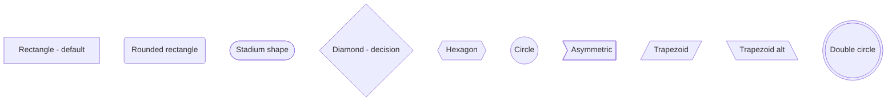
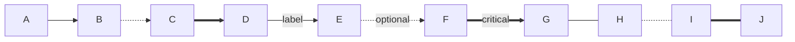
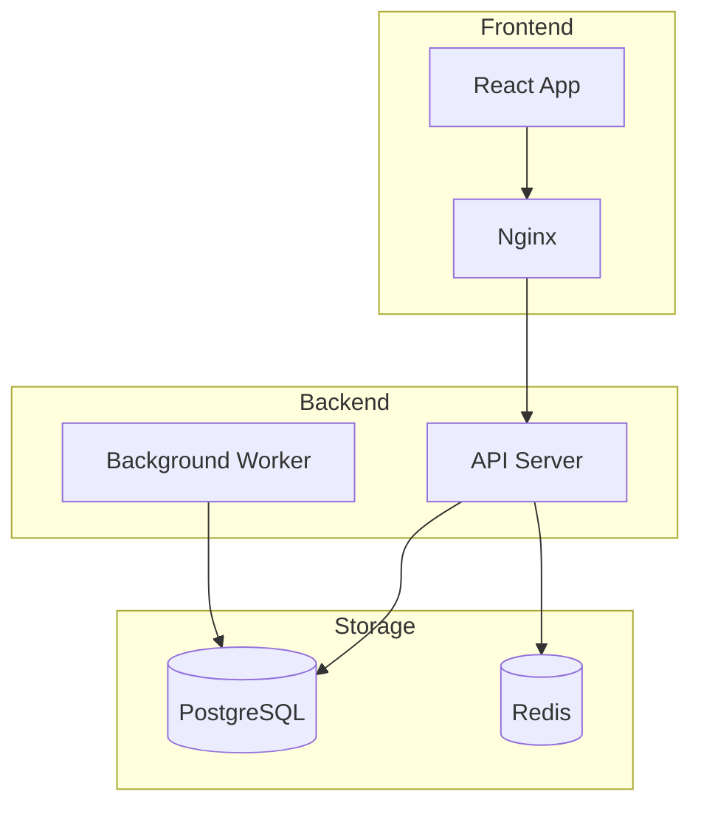
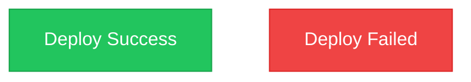
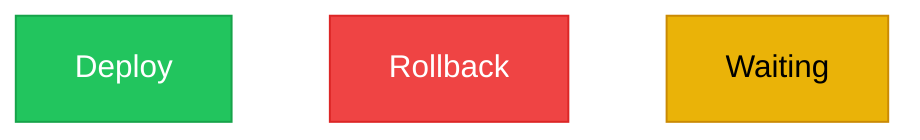
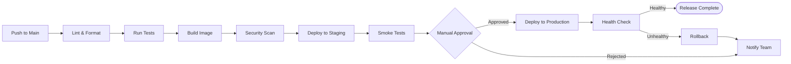
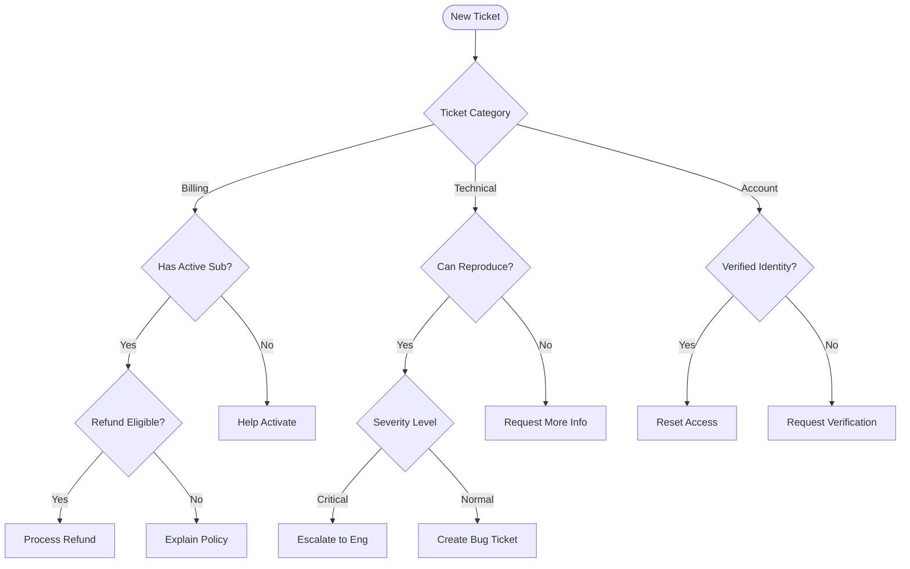
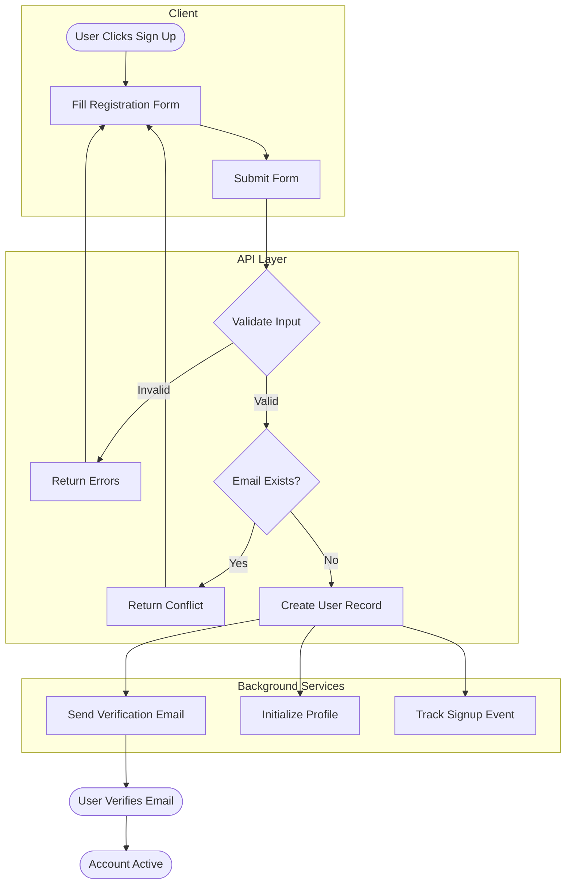

# Flowchart Reference

## When to Use

Flowcharts are the most versatile diagram type. Use them for:

- **Processes and pipelines** -- deployment, CI/CD, data processing
- **Decision trees** -- support triage, approval workflows, feature flags
- **User journeys** -- signup flows, onboarding, checkout
- **System architecture** -- high-level component relationships
- **Troubleshooting guides** -- diagnostic paths with yes/no branches

## Syntax Reference

### Direction

```
graph TD    %% Top to Down (hierarchical)
graph LR    %% Left to Right (sequential)
graph TB    %% Top to Bottom (same as TD)
graph BT    %% Bottom to Top
graph RL    %% Right to Left
```

Choose `TD` for hierarchical structures (trees, org charts, decision flows).
Choose `LR` for sequential processes (pipelines, timelines, data flows).

### Node Shapes



Common usage:
- `[rect]` -- standard process steps
- `(rounded)` -- start/end points
- `{diamond}` -- decisions (yes/no, if/else)
- `((circle))` -- connectors or events
- `([stadium])` -- inputs/outputs

### Edge Types



| Syntax | Meaning |
|---|---|
| `-->` | Solid arrow (primary flow) |
| `-.->` | Dotted arrow (optional/async) |
| `==>` | Thick arrow (critical/highlighted) |
| `-->|label|` | Arrow with label |
| `---` | Solid line (no arrow) |
| `-.-` | Dotted line (no arrow) |
| `===` | Thick line (no arrow) |

### Subgraphs



Use subgraphs when you have more than 7 nodes to group related components. Always give subgraphs a descriptive label.

### Styling



Or use class definitions for reusable styles:



## Example 1: CI/CD Deployment Pipeline

A left-to-right pipeline showing the stages of a deployment process.



## Example 2: Customer Support Decision Tree

A top-down decision tree for routing customer support tickets.



## Example 3: User Signup Flow with Subgraphs

A top-down flow showing the user registration process grouped by responsibility area.



## Best Practices

1. **Start with the happy path** -- lay out the primary flow first, then add branches for errors and edge cases
2. **Keep decision nodes binary when possible** -- yes/no or success/fail is clearest. For multi-way decisions, use a chain of binary decisions or list the options as labeled edges
3. **Use consistent node shapes** -- pick a convention (e.g., rectangles for steps, diamonds for decisions, stadiums for start/end) and stick with it throughout the diagram
4. **Label all decision edges** -- every arrow leaving a diamond should have a label explaining the condition
5. **Limit branching depth to 4 levels** -- deeper nesting makes diagrams hard to follow. Consider splitting into sub-diagrams
6. **Name nodes by what they DO, not what they ARE** -- `validate_input` is better than `validator`, `send_email` is better than `email_service`

## Common Pitfalls

- **Forgetting to quote labels with special characters** -- `A["Step (1): Init"]` needs quotes when using parentheses
- **Circular references without context** -- loops like `A --> B --> A` need a label or condition to explain when the loop exits
- **Too many crossing edges** -- rearrange node order or use subgraphs to minimize line crossings
- **Mixing directions in one diagram** -- stick to one direction (TD or LR) per diagram. Subgraphs inherit the parent direction
- **Using single-character IDs** -- `A`, `B`, `C` make diagrams hard to maintain. Always use descriptive IDs
