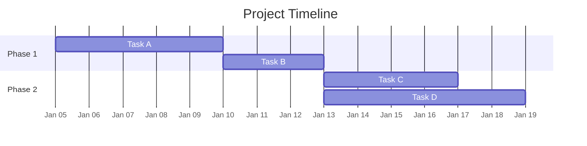
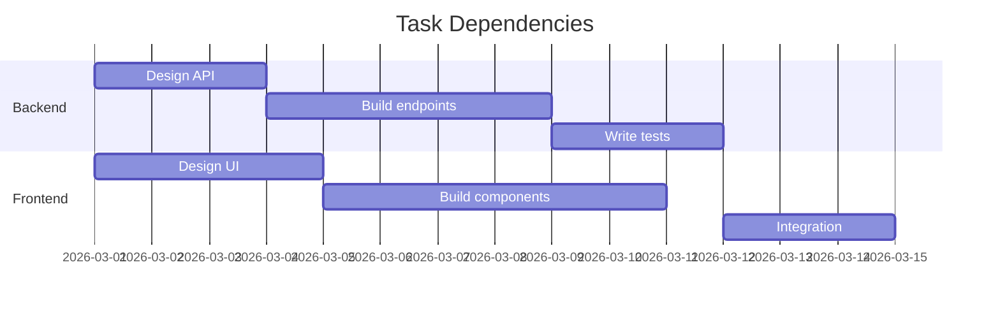
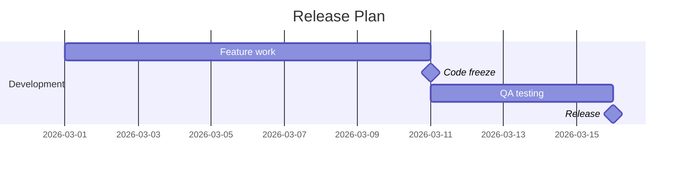
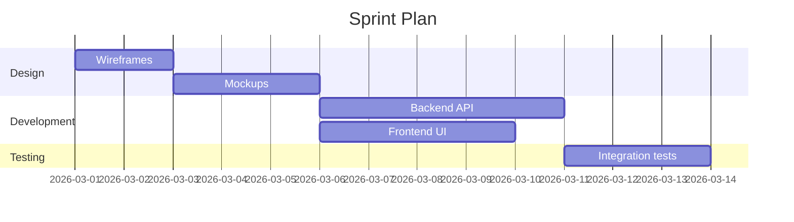
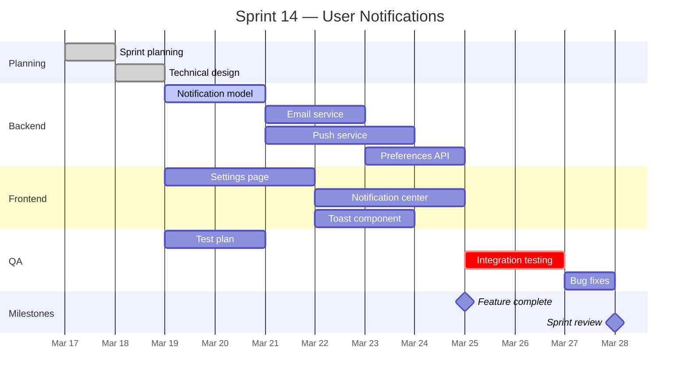
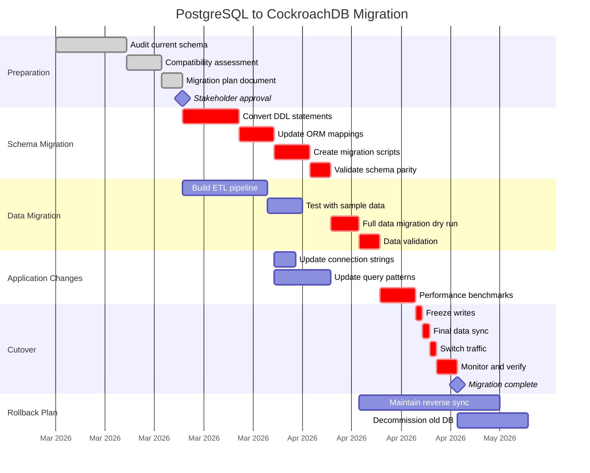

# Gantt Chart Reference

## When to Use

Gantt charts show tasks plotted against time. Use them for:

- **Project timelines** -- feature development across weeks or months
- **Sprint plans** -- task allocation within a two-week sprint
- **Migration roadmaps** -- phased rollouts with dependencies
- **Release schedules** -- coordinating work across teams
- **Onboarding plans** -- structured task sequences over days or weeks

## Syntax Reference

### Basic Structure



### Date Formats

| Setting | Format | Example |
|---|---|---|
| `dateFormat YYYY-MM-DD` | ISO date input | `2026-03-15` |
| `axisFormat %b %d` | Axis display (Month Day) | `Mar 15` |
| `axisFormat %Y-%m-%d` | Axis display (full date) | `2026-03-15` |
| `axisFormat %b %Y` | Axis display (Month Year) | `Mar 2026` |
| `axisFormat %d %b` | Axis display (Day Month) | `15 Mar` |

### Task Syntax

```
Task name    :status id, start, duration_or_end
```

**Status modifiers:**

| Status | Syntax | Rendering |
|---|---|---|
| Normal | `:task1, 2026-01-05, 5d` | Default bar |
| Active | `:active, task1, 2026-01-05, 5d` | Highlighted bar |
| Done | `:done, task1, 2026-01-05, 5d` | Dimmed/completed bar |
| Critical | `:crit, task1, 2026-01-05, 5d` | Red/critical bar |
| Milestone | `:milestone, m1, 2026-01-10, 0d` | Diamond marker |
| Critical + Active | `:crit, active, task1, 2026-01-05, 5d` | Red + highlighted |

### Start Options

- **Absolute date:** `2026-03-15`
- **After another task:** `after task_id`
- **After multiple tasks:** `after task_a task_b` (starts when both complete)

### Duration

- Days: `5d`
- Hours: `8h`
- Absolute end date: `2026-03-20` (instead of a duration)

### Dependencies

Chain tasks using `after`:



### Milestones



### Sections

Group tasks into sections for visual organization:



## Example 1: Two-Week Sprint Plan



## Example 2: Database Migration Roadmap with Critical Path



## Best Practices

1. **Use sections to organize tasks** -- group by team, phase, or workstream. A flat list of 20+ tasks is hard to scan
2. **Mark critical path tasks** -- use `:crit` on tasks that, if delayed, would push back the overall deadline. This highlights the most important chain
3. **Use dependencies (`after`) instead of hardcoded dates** -- `after task_a` is more maintainable than `2026-03-15` because shifting one task automatically shifts its dependents
4. **Add milestones for key checkpoints** -- sprint reviews, approvals, go-live dates. Milestones are zero-duration markers that anchor the timeline
5. **Use `done` and `active` status** -- mark completed tasks as `:done` and current tasks as `:active` so the chart shows progress at a glance
6. **Keep task names short** -- they appear as bar labels. Aim for 3-5 words
7. **Limit total tasks to 25** -- larger Gantt charts become unreadable. For complex projects, break into multiple charts by phase or team

## Prompting for Input

Gantt charts require structured data. When the user's request is vague, prompt for:

1. **What are the main tasks or phases?**
2. **What is the start date?**
3. **How long is each task (in days or weeks)?**
4. **Are there dependencies between tasks?** (What must finish before what can start?)
5. **Are there any milestones or deadlines?**
6. **Which tasks are critical or high-priority?**

If the user provides only a rough outline (e.g., "3-month migration plan"), propose a reasonable breakdown and ask them to confirm or adjust before rendering.

## Common Pitfalls

- **Forgetting `dateFormat`** -- without it, Mermaid may misparse dates. Always include `dateFormat YYYY-MM-DD`
- **Circular dependencies** -- `after a` on task B and `after b` on task A creates an impossible cycle. Mermaid will error
- **Tasks with no start** -- every task needs either an absolute start date or an `after` reference. Mermaid will not infer start dates
- **Overlapping section names** -- each section name must be unique. Duplicate section names cause rendering issues
- **Missing task IDs on tasks that are referenced** -- if another task uses `after my_task`, then `my_task` must have an explicit ID in its definition
