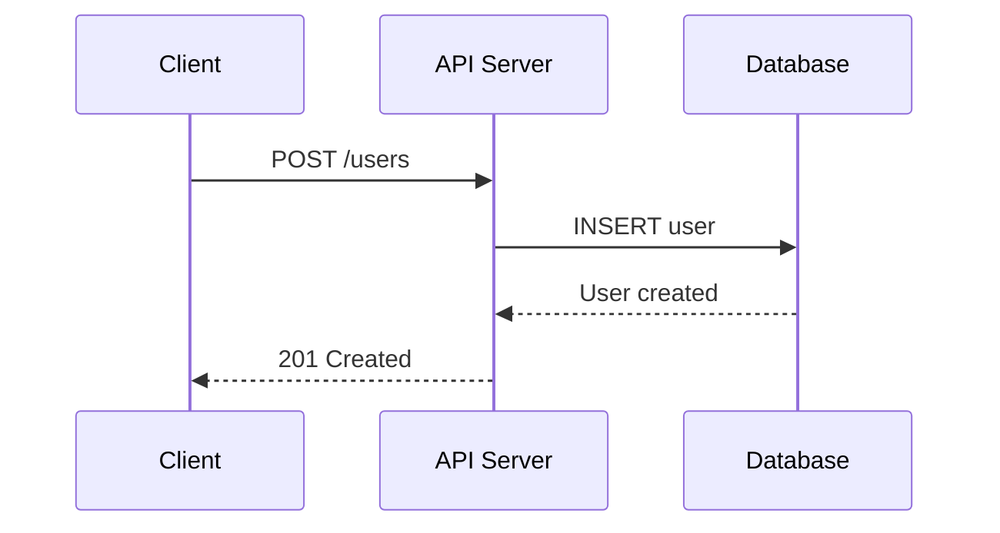
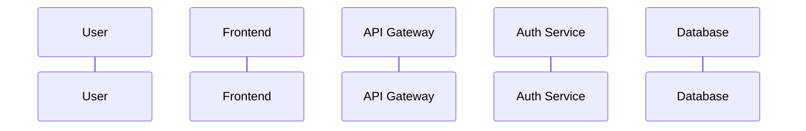
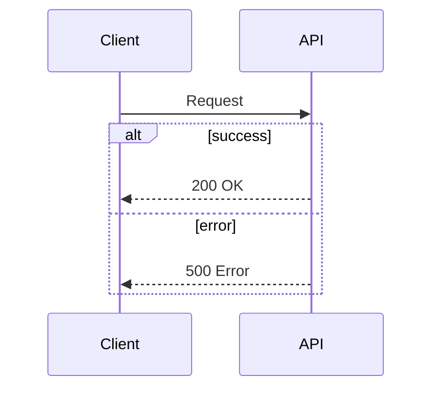
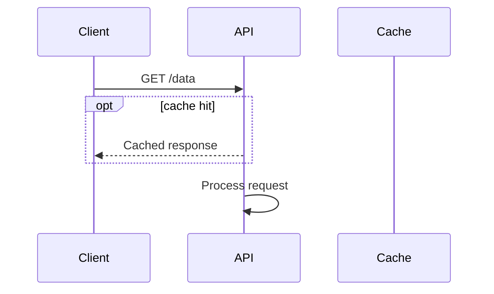
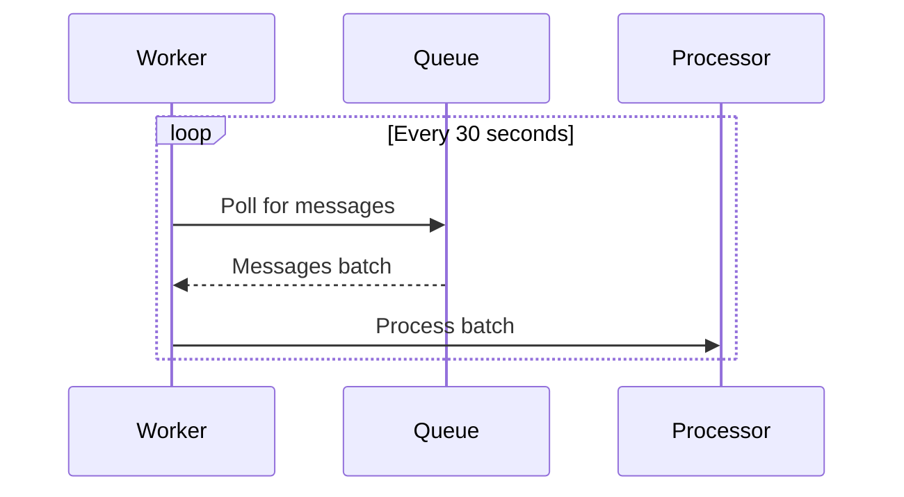
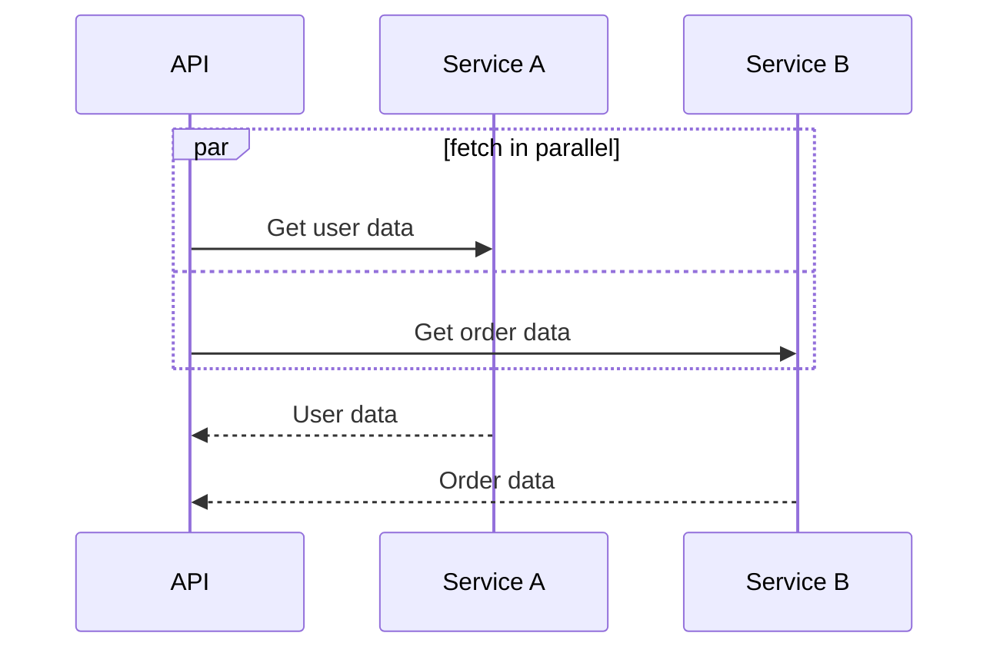
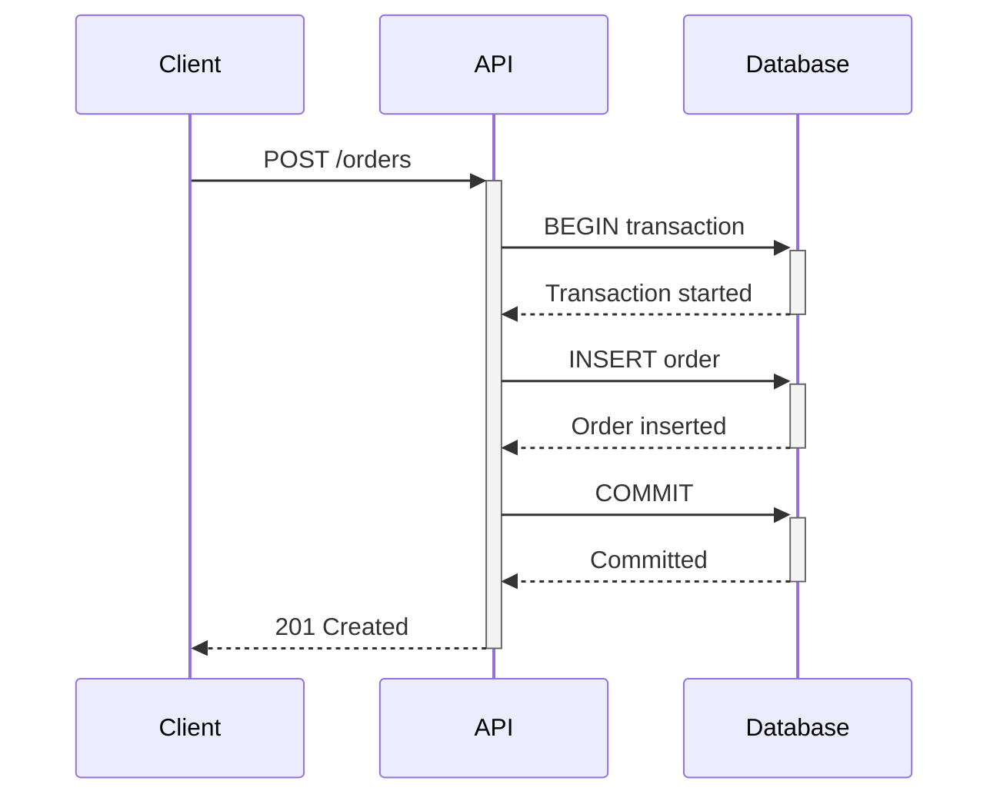
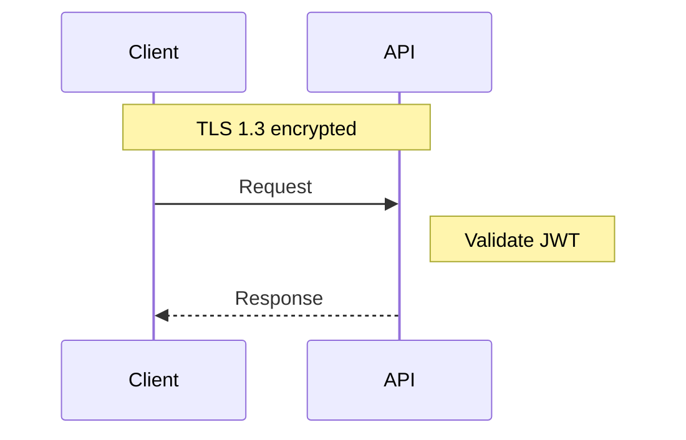
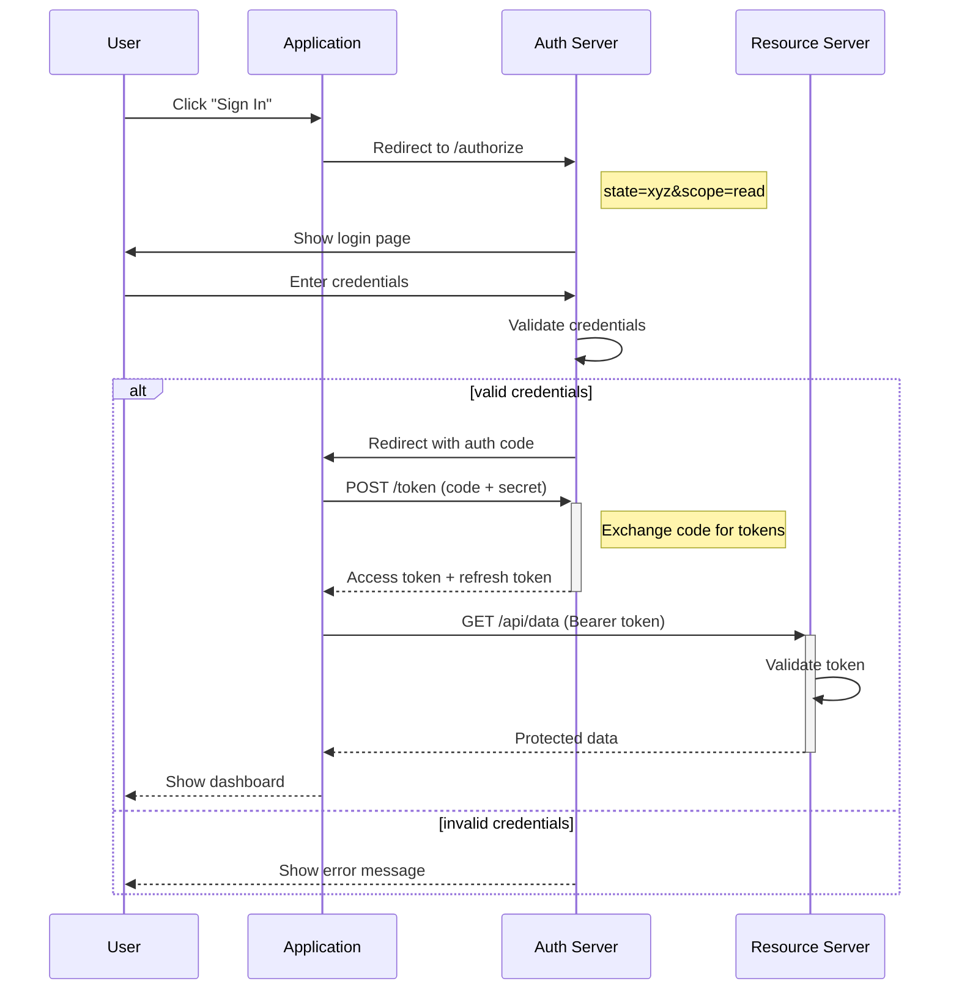
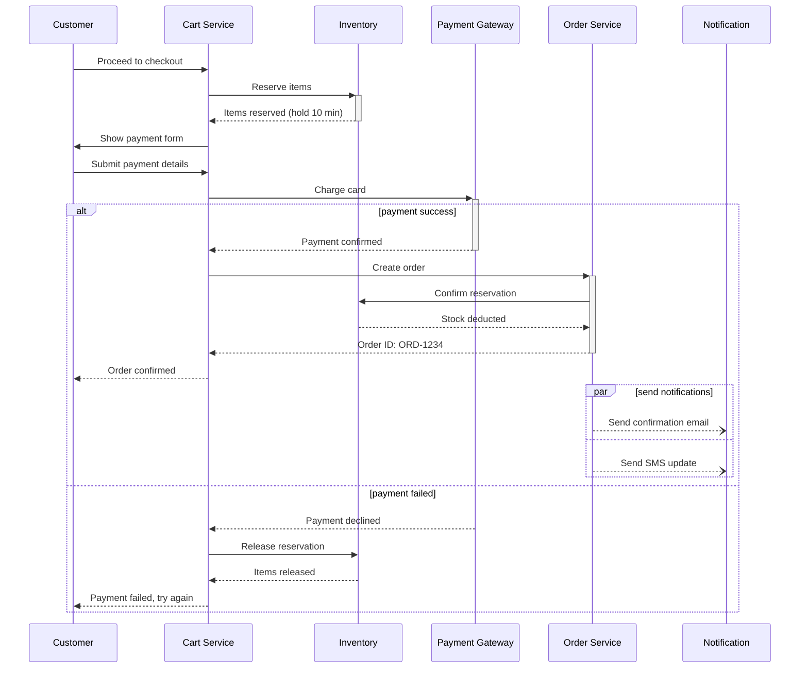

# Sequence Diagram Reference

## When to Use

Sequence diagrams show interactions between participants over time. Use them for:

- **API flows** -- request/response cycles between client and server
- **Service-to-service interactions** -- microservice communication patterns
- **Authentication flows** -- OAuth2, SAML, JWT refresh
- **Webhook and event-driven flows** -- publish/subscribe, event sourcing
- **User-system interactions** -- how a user action triggers backend processing

## Syntax Reference

### Basic Structure

### Participant Aliases

Define participants at the top to control their order and display names:

Participants appear left-to-right in the order they are declared. Order them by first interaction for a natural reading flow.

### Message Types

| Syntax | Meaning | Use For |
|---|---|---|
| `->>` | Solid arrow (synchronous) | HTTP requests, function calls |
| `-->>` | Dotted arrow (response) | HTTP responses, return values |
| `--)` | Async message (open arrow) | Events, webhooks, queue messages |
| `--x` | Lost message | Timeouts, failures |
| `->>+` | Activate target | Start of processing |
| `->>-` | Deactivate target | End of processing |

### Control Flow

**Alt/Else (conditional):**

**Opt (optional):**

**Loop:**

**Par (parallel):**

### Activation Boxes

Show when a participant is actively processing:

### Notes

## Example 1: OAuth2 Authorization Code Flow

## Example 2: E-commerce Checkout Flow

## Best Practices

1. **Order participants by first interaction** -- the leftmost participant should be the initiator (usually the user or client), and participants should appear roughly in the order they first get called
2. **Keep participant count under 6** -- more than 6 participants makes the diagram wide and hard to read. If you need more, consider splitting into multiple diagrams by bounded context
3. **Use aliases for long names** -- `participant gw as API Gateway` keeps the diagram compact
4. **Show the happy path first, then alternatives** -- use `alt/else` for error cases rather than mixing them into the main flow
5. **Label messages with action verbs** -- "POST /users" or "Validate token" is better than just "request" or "data"
6. **Use activation boxes sparingly** -- they add clarity for long-running operations but clutter simple request/response pairs
7. **Add notes for non-obvious context** -- encryption, token formats, retry policies

## Common Pitfalls

- **Forgetting return arrows** -- every request (`->>`) should eventually have a response (`-->>`) unless it is fire-and-forget
- **Inconsistent message direction** -- responses should always go back toward the caller, not forward to the next participant
- **Too many nested alt/else blocks** -- more than 2 levels of nesting is hard to read. Flatten by splitting into separate diagrams
- **Missing participant declarations** -- always declare participants explicitly at the top to control ordering. Letting Mermaid auto-detect order can produce unexpected layouts
- **Using activation on fire-and-forget messages** -- async messages (`--)`) should not use activation since the sender does not wait
