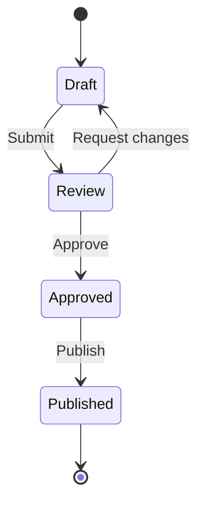
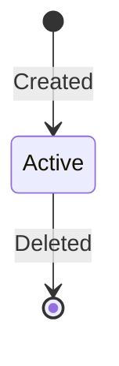
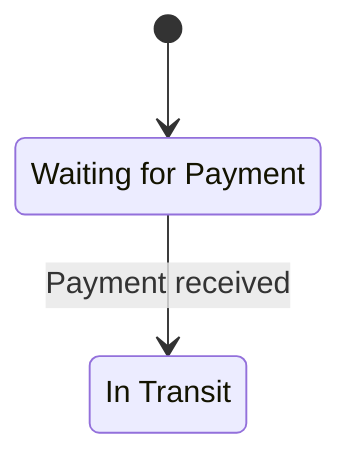
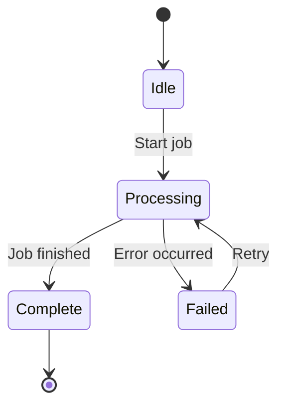
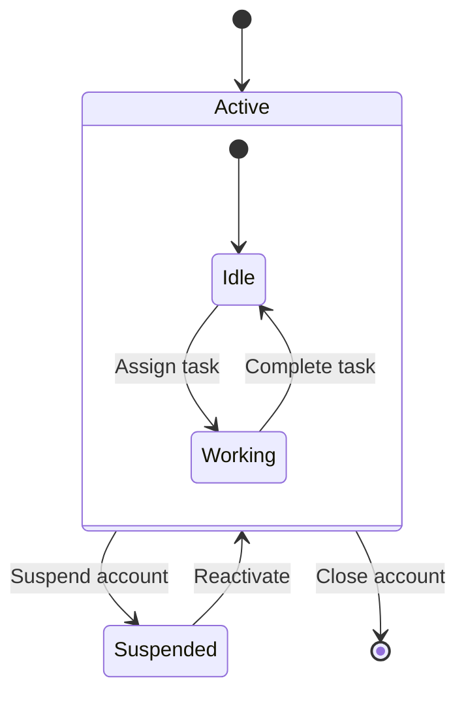
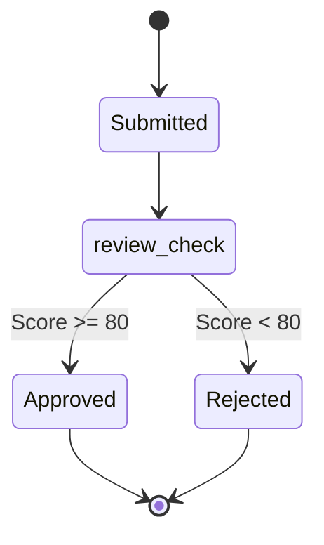
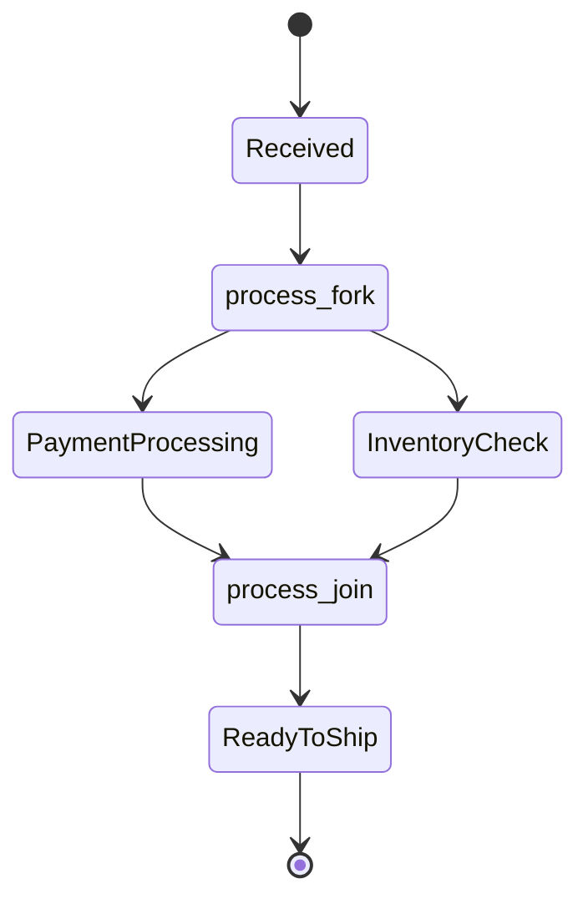
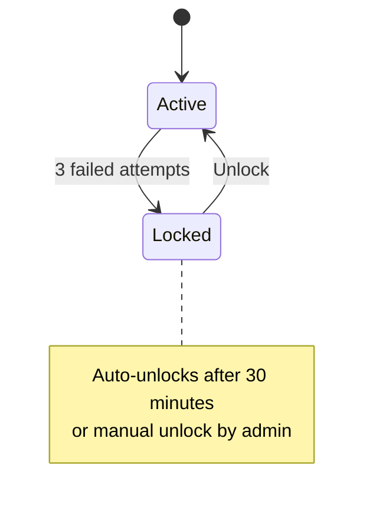
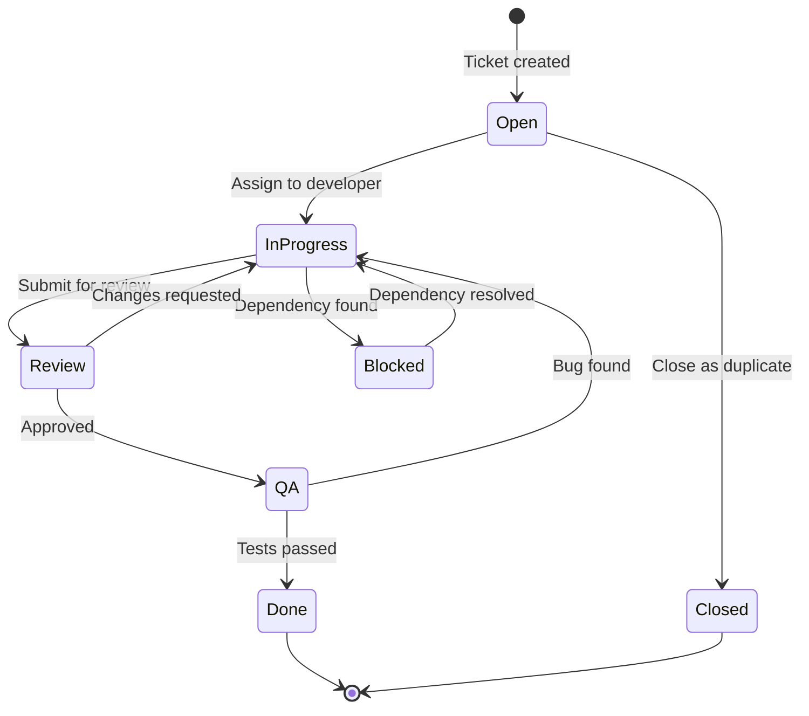
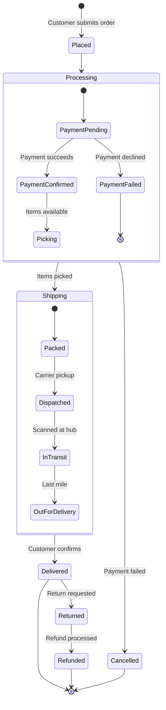

# State Diagram Reference

## When to Use

State diagrams show how an entity transitions between states over its lifecycle. Use them for:

- **Ticket/issue lifecycles** -- backlog to done, with review and blocked states
- **Order statuses** -- placed, processing, shipped, delivered, returned
- **State machines** -- feature flags, circuit breakers, connection states
- **Document workflows** -- draft, review, approved, published
- **User account states** -- active, suspended, deactivated, deleted

## Syntax Reference

### Basic Structure

Always use `stateDiagram-v2` (not the legacy `stateDiagram`).

### Start and End Markers

- `[*]` at the start of a transition = start state (filled circle)
- `[*]` at the end of a transition = end state (circle with border)

Always include a `[*] -->` start marker. Include an end marker (`--> [*]`) when the entity has a terminal state.

### State Descriptions

Use the `state "Label" as id` syntax when state names contain spaces or special characters.

### Transitions with Events

Label transitions with the event or action that causes them:

### Composite (Nested) States

Group related states inside a parent state:

### Choice Pseudo-State

Use `<<choice>>` for conditional branching:

### Fork and Join

Use `<<fork>>` and `<<join>>` for parallel state transitions:

### Notes

## Example 1: Ticket Lifecycle

A complete ticket workflow from creation through resolution.

## Example 2: E-commerce Order with Composite States

An order lifecycle with grouped processing and shipping states.

## Best Practices

1. **Always include start and end markers** -- `[*]` at the beginning and end makes the lifecycle boundaries clear
2. **Always use `stateDiagram-v2`** -- the v2 syntax has better rendering, composite state support, and choice/fork/join pseudo-states
3. **Label every transition with the event** -- transitions without labels leave the reader guessing what triggers the change. Write the triggering action or event on every arrow
4. **Show error and recovery paths** -- a state diagram is incomplete without showing what happens when things go wrong (failed payments, rejected reviews, timeouts)
5. **Use composite states for phases** -- if your lifecycle has clear phases (e.g., "Processing" contains payment and picking), nest related states to reduce top-level clutter
6. **Limit top-level states to 8** -- beyond that, use composite states or split into multiple diagrams
7. **Name states as adjectives or past participles** -- "Approved", "InProgress", "Shipped" are clearer than "Approve", "Progress", "Ship"

## Common Pitfalls

- **Missing start marker** -- every state diagram should begin with `[*] -->`. Without it, the entry point is ambiguous
- **Dead-end states with no exit** -- if a state has no outgoing transition and is not `[*]`, it traps the entity. Either add an exit path or mark it as terminal with `--> [*]`
- **Using legacy `stateDiagram` syntax** -- always use `stateDiagram-v2`. The v1 syntax lacks composite states, choice, fork/join, and has rendering issues
- **Transition labels that describe the target state instead of the event** -- write "Payment succeeds" (event), not "Paid" (state name). The arrow already points to the target state
- **Overly complex single diagrams** -- if you have more than 12 states at the top level, consider splitting by lifecycle phase into separate diagrams
