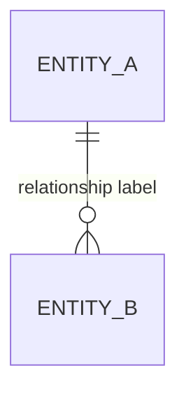
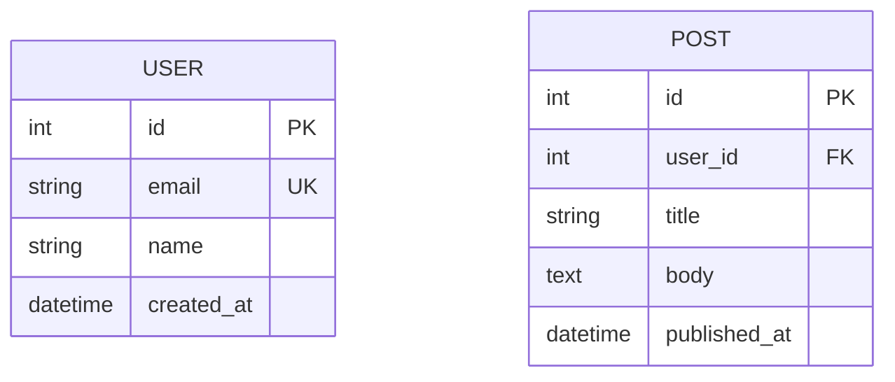
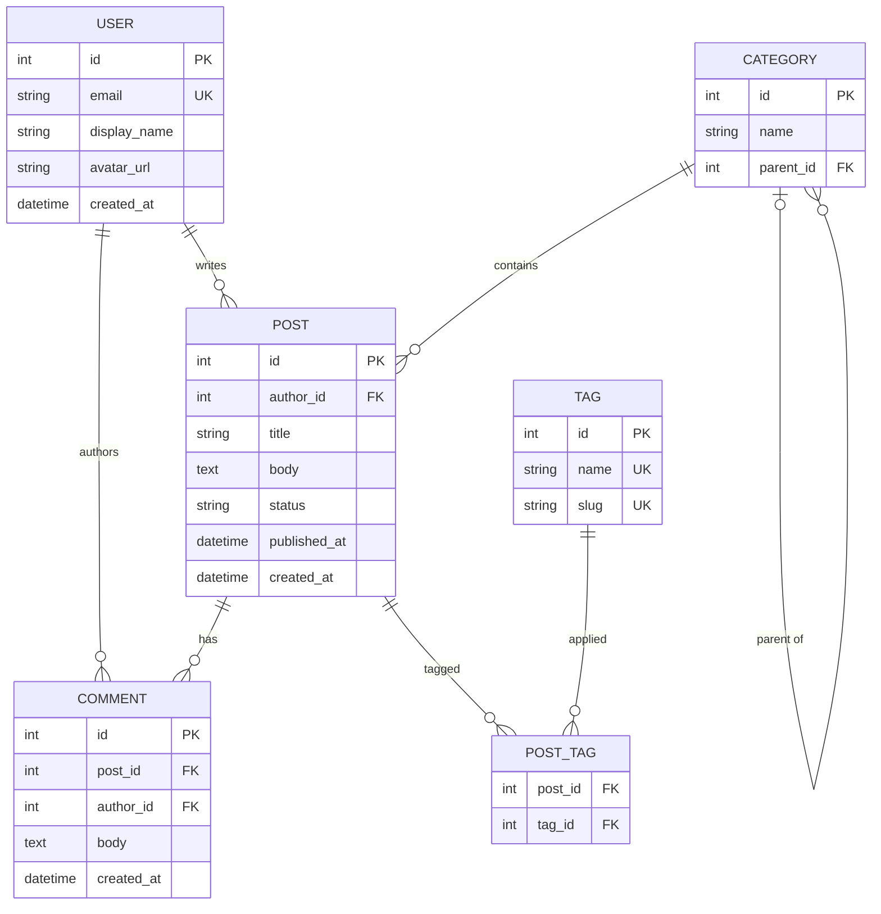
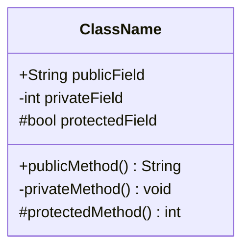
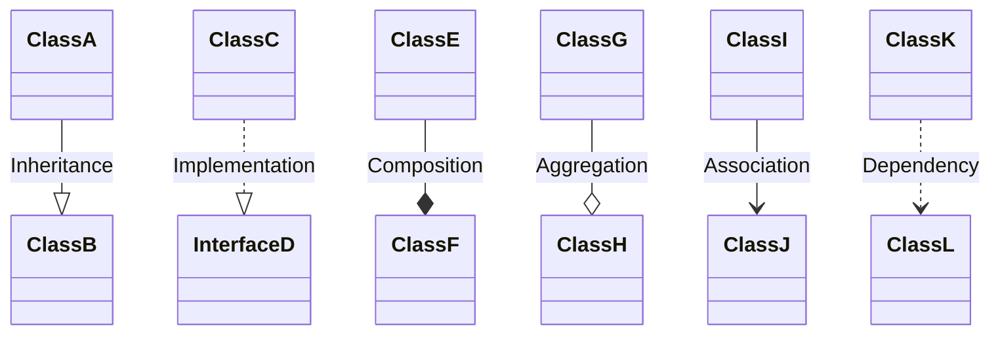
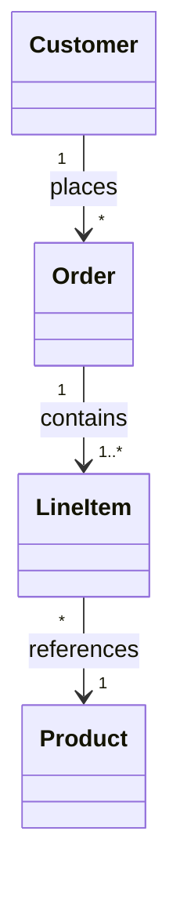
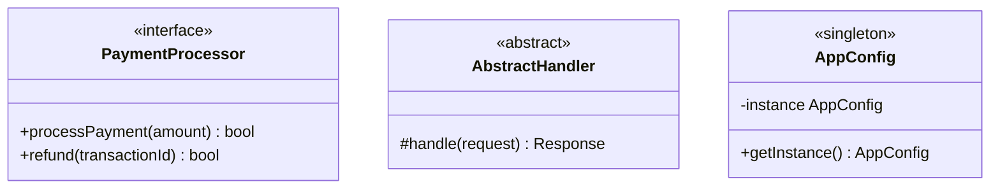
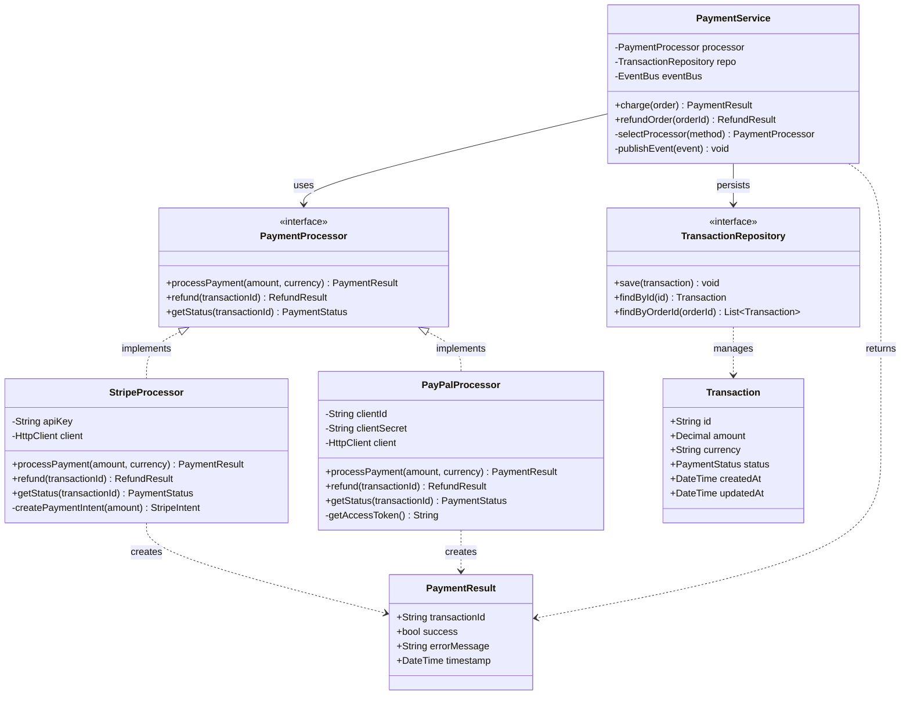

# Technical Diagrams Reference (ER + Class)

## Audience Note

ER diagrams and class diagrams are engineering-focused. If the user's request sounds non-technical (e.g., "show how users relate to orders"), consider suggesting a **flowchart** instead, which is more universally understood. Only use ER/class diagrams when the user explicitly asks for one or the context is clearly technical (database design, OOP modeling, API contracts).

## FigJam Export: NOT Supported

ER diagrams and class diagrams cannot be exported to FigJam via `generate_diagram`. If the user asks to export one of these types, inform them of the limitation and suggest screenshotting the rendered diagram instead.

---

## ER Diagrams

### When to Use

- **Database schema design** -- modeling tables and their relationships
- **Data modeling** -- entities, attributes, and cardinality
- **API contract visualization** -- how resources relate to each other

### Syntax



### Relationship Notation

The notation uses two symbols -- one on each side of the line -- to describe cardinality:

| Left Symbol | Meaning |
|---|---|
| `\|\|` | Exactly one |
| `o\|` | Zero or one |
| `}o` | Zero or more |
| `}\|` | One or more |

| Right Symbol | Meaning |
|---|---|
| `\|\|` | Exactly one |
| `\|o` | Zero or one |
| `o{` | Zero or more |
| `\|{` | One or more |

**Common relationship patterns:**

```
||--||    One-to-one (exactly one on each side)
||--o{    One-to-many (one on left, zero or more on right)
|o--o{    Zero-or-one to zero-or-many
||--|{    One to one-or-more (required on both sides)
}o--o{    Many-to-many (through join table)
```

### Attributes



Attribute modifiers:
- `PK` -- primary key
- `FK` -- foreign key
- `UK` -- unique key

### Example: Blog System



### ER Best Practices

1. **Name entities as singular nouns** -- `USER` not `USERS`, `ORDER` not `ORDERS`
2. **Always include primary keys** -- mark with `PK` for clarity
3. **Mark foreign keys** -- use `FK` to show which fields link to other tables
4. **Label relationships with verbs** -- `writes`, `contains`, `belongs to` make the diagram self-documenting
5. **Show join tables for many-to-many** -- explicitly model the intermediate table (e.g., `POST_TAG`) rather than drawing a direct many-to-many line
6. **Keep entity count under 10** -- beyond that, split by domain or bounded context

---

## Class Diagrams

### When to Use

- **Object-oriented design** -- class hierarchies, interfaces, abstract classes
- **Design patterns** -- documenting strategy, observer, factory patterns
- **API service contracts** -- showing method signatures and relationships
- **Domain modeling** -- rich domain objects with behavior

### Syntax



### Visibility Modifiers

| Symbol | Meaning |
|---|---|
| `+` | Public |
| `-` | Private |
| `#` | Protected |
| `~` | Package/Internal |

### Relationship Types



| Syntax | Relationship | Meaning |
|---|---|---|
| `--\|>` | Inheritance | "is a" (solid line, closed arrow) |
| `..\|>` | Implementation | "implements" (dotted line, closed arrow) |
| `--*` | Composition | "owns" (solid line, filled diamond) |
| `--o` | Aggregation | "has" (solid line, open diamond) |
| `-->` | Association | "uses" (solid line, open arrow) |
| `..>` | Dependency | "depends on" (dotted line, open arrow) |

### Cardinality



### Annotations



### Example: Payment System



### Class Diagram Best Practices

1. **Start with interfaces and abstractions** -- show the contracts first, then concrete implementations
2. **Use annotations** -- `<<interface>>`, `<<abstract>>`, `<<singleton>>`, `<<enum>>` make the design intent clear
3. **Show only relevant methods** -- include key public methods and important private ones. Skip getters/setters and boilerplate
4. **Use composition over inheritance** -- if the relationships are mostly `--|>`, consider whether the design is too inheritance-heavy
5. **Label relationships** -- `uses`, `creates`, `manages` on association arrows explain the nature of the dependency
6. **Keep classes under 8** -- for larger systems, focus on one bounded context or one design pattern per diagram
7. **Group by layer** -- if showing a layered architecture, arrange classes vertically (controller at top, repository at bottom)

---

## Common Pitfalls (Both Types)

- **Overloading a single diagram** -- both ER and class diagrams become unreadable beyond 10 entities/classes. Split by domain
- **Missing relationship labels** -- unlabeled lines force the reader to guess the nature of the connection
- **Inconsistent naming** -- pick a convention (PascalCase for classes, UPPER_SNAKE for entities) and stick with it
- **Showing implementation details in an architecture diagram** -- if the audience is non-technical, use a flowchart instead
